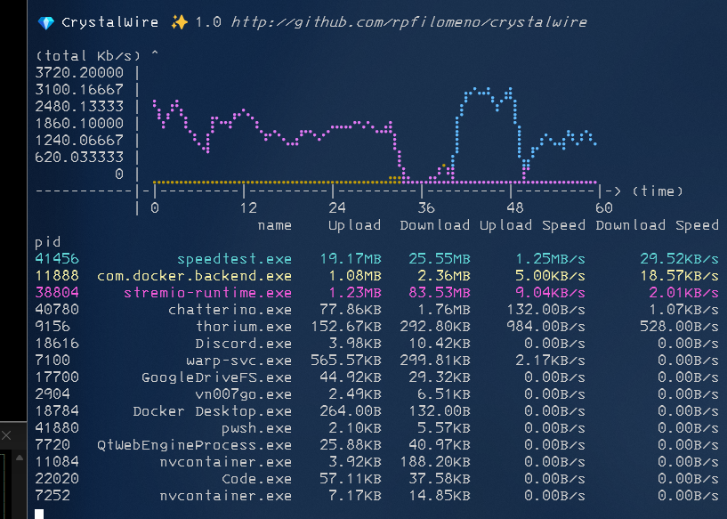

"It's like Glasswire for Terminals!"

## Crystalwire

Monitor bandwidth usage, per process!

'crystalwire' is a simple command-line tool that provides real-time monitoring of network bandwidth usage for each running process. It uses the `psutil` library to gather system information and displays the results in a user-friendly format.
### Installation
To install 'crystalwire', you can use pip:
``
pip install -r requirements.txt
``
### Usage
Once installed, you can run 'crystalwire' from the command line:
``
python -m crystalwire.main
``

